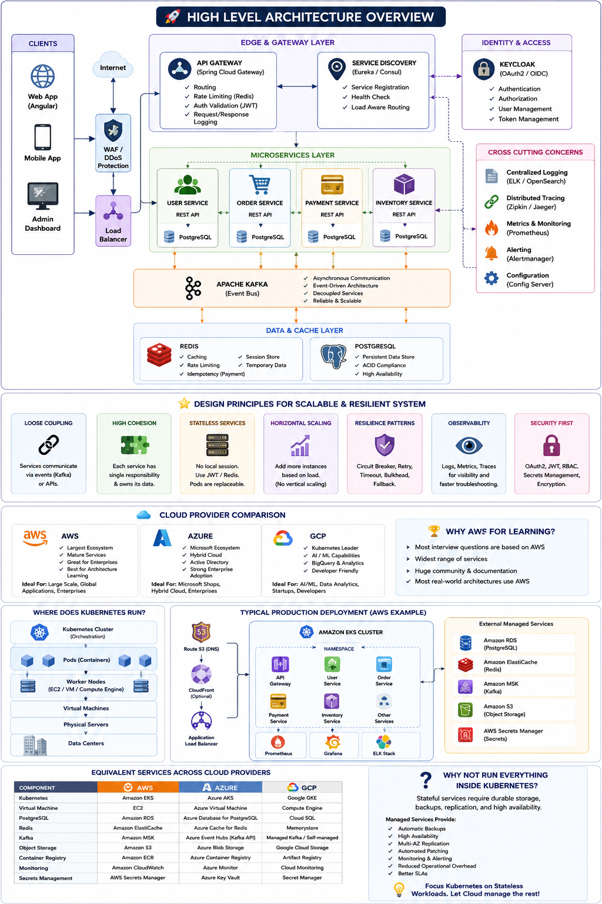

# EasyShop Microservices Architecture

[](https://github.com/yaseenshar/EasyShop/actions)
[](#tech-stack)
[](#tech-stack)
[](#core-highlights)
[](#deployment)

A production-grade, event-driven e-commerce platform built with **Spring Boot**, **Kafka**, and **Kubernetes**, implementing **Saga choreography**, **Transactional Outbox**, and **resilient distributed system patterns**.

---

## Table of Contents

- [High-Level Architecture](#high-level-architecture)
- [Core Highlights](#core-highlights)
- [Tech Stack](#tech-stack)
- [System Components](#system-components)
- [Repository Structure](#repository-structure)
- [Prerequisites](#prerequisites)
- [Quick Start (Local)](#quick-start-local)
- [Configuration](#configuration)
- [Run with Docker Compose](#run-with-docker-compose)
- [Deployment](#deployment)
- [Observability](#observability)
- [Security](#security)
- [Testing](#testing)
- [API Documentation](#api-documentation)
- [Troubleshooting](#troubleshooting)
- [Roadmap](#roadmap)
- [Contributing](#contributing)
- [License](#license)

---

## High-Level Architecture



### Request/Event Flow (Summary)

1. Client calls APIs via **API Gateway**
2. Gateway validates JWT and forwards to target service
3. **Order Service** initiates checkout and publishes domain events to Kafka
4. **Inventory** and **Payment** services consume events and publish outcomes
5. Saga completes (success/failure) with compensating actions if needed
6. Metrics, traces, and logs are captured across services

---

## Core Highlights

- **Event-Driven Saga Choreography** for distributed checkout workflows
- **Transactional Outbox Pattern** for reliable event publishing
- **Resilience4j** (circuit breaker, retries, bulkheads) to avoid cascading failures
- **Idempotency** for state-changing APIs (order/payment critical paths)
- **Centralized Authentication/Authorization** with Keycloak (OAuth2 + JWT)
- **Cloud-Native Observability** with Prometheus, Grafana, ELK, and Jaeger
- **Containerized + Orchestrated** using Docker, Kubernetes, Helm, and Istio

---

## Tech Stack

- **Backend:** Java 21, Spring Boot, Spring Cloud, Spring Data JPA
- **Messaging:** Apache Kafka, Zookeeper
- **Databases:** PostgreSQL, MySQL, Redis
- **Security:** Keycloak, Spring Security, OAuth2/JWT, RBAC
- **DevOps:** Docker, Docker Compose, Kubernetes, Helm, Istio, GitHub Actions
- **Observability:** Micrometer, Prometheus, Grafana, Elasticsearch, Logstash, Jaeger

---

## System Components

- **API Gateway**: Single entry point, auth enforcement, routing, rate-limiting (if enabled)
- **Auth/Identity (Keycloak)**: OAuth2 authorization server and token issuance
- **Product Service**: Product catalog and availability queries
- **Cart Service**: Session/user cart management (Redis-backed)
- **Order Service**: Checkout orchestration via event choreography
- **Inventory Service**: Stock reservation and release
- **Payment Service**: Payment authorization/capture and rollback events
- **Notification Service**: Async notifications (email/SMS/push - optional extension)

---

## Repository Structure

```text
EasyShop/
├─ backend/                     # Java/Maven multi-module reactor
│  ├─ common/
│  │  └─ common-lib/            # shared DTOs, exception handling, security converter
│  ├─ infrastructure/
│  │  ├─ service-discovery/     # Eureka
│  │  └─ api-gateway/           # Spring Cloud Gateway (BFF + resource server)
│  ├─ services/
│  │  ├─ user-service/
│  │  ├─ catalog-service/
│  │  ├─ cart-service/
│  │  ├─ order-service/
│  │  ├─ inventory-service/
│  │  ├─ payment-service/
│  │  ├─ review-service/
│  │  └─ notification-service/
│  └─ pom.xml                   # parent/reactor POM
├─ frontend/                    # Angular SPA
│  └─ src/
├─ infra/
│  ├─ docker-compose.yml
│  └─ docker/                   # Keycloak realm+theme, Postgres/MySQL init, Grafana/Prometheus config
├─ scripts/                     # setup + adversarial verification tooling
│  ├─ rbac/
│  ├─ resource-server-hardening/
│  ├─ integration-verification/
│  └─ keycloak-setup/
├─ docs/
│  └─ images/
│     └─ architecture.png
└─ README.md
```

---

## Prerequisites

Make sure these are installed before running locally:

- **Java 21**
- **Maven 3.9+**
- **Docker & Docker Compose**
- **Git**
- Optional for Kubernetes deployment:
  - `kubectl`
  - `helm`
  - Access to a Kubernetes cluster (kind/minikube/EKS/GKE/AKS)

### Recommended machine resources

- CPU: 4 cores+
- RAM: 8 GB minimum (12 GB recommended with full observability stack)
- Disk: 10 GB free

---

## Quick Start (Local)

### 1) Clone repository

```bash
git clone https://github.com/yaseenshar/EasyShop.git
cd EasyShop
```

### 2) Start infrastructure dependencies

```bash
docker compose -f infra/docker-compose.yml up -d
```

### 3) Build all services

```bash
cd backend && mvn clean install -DskipTests && cd ..
```

### 4) Run services

You can run each service individually:

```bash
cd backend/infrastructure/api-gateway && mvn spring-boot:run
```

```bash
cd backend/services/order-service && mvn spring-boot:run
```

Repeat for the remaining services. Or just build the containers via Docker Compose
(next section) instead of running each one with Maven.

### 5) Run the frontend

```bash
cd frontend && npm install && ng serve --proxy-config proxy.conf.json
```

---

## Configuration

Create a local `.env` (or per-service `application-dev.yml`) from `.env.example`.

### Common environment variables

| Variable | Description | Example |
|---|---|---|
| `SPRING_PROFILES_ACTIVE` | Active runtime profile | `dev` |
| `SERVER_PORT` | Service port | `8083` |
| `KAFKA_BOOTSTRAP_SERVERS` | Kafka brokers | `localhost:9092` |
| `REDIS_HOST` | Redis host | `localhost` |
| `REDIS_PORT` | Redis port | `6379` |
| `DB_HOST` | Database host | `localhost` |
| `DB_PORT` | Database port | `5432` |
| `DB_NAME` | Database name | `easyshop_order` |
| `DB_USERNAME` | DB username | `easyshop` |
| `DB_PASSWORD` | DB password | `easyshop` |
| `KEYCLOAK_ISSUER_URI` | JWT issuer realm endpoint | `http://localhost:8081/realms/easyshop` |
| `KEYCLOAK_JWK_SET_URI` | JWK endpoint for token validation | `http://localhost:8081/realms/easyshop/protocol/openid-connect/certs` |

> Never commit real secrets. Use GitHub Secrets / Kubernetes Secrets / Vault for non-local environments.

---

## Run with Docker Compose

```bash
docker compose -f infra/docker-compose.yml up -d --build
docker compose -f infra/docker-compose.yml ps
```

To stop:

```bash
docker compose -f infra/docker-compose.yml down
```

To stop and remove volumes:

```bash
docker compose -f infra/docker-compose.yml down -v
```

---

## Service Endpoints (Example Defaults)

> Update these values if your actual ports differ.

| Component | URL | Port |
|---|---|---|
| API Gateway | `http://localhost:8080` | 8080 |
| Product Service | `http://localhost:8082` | 8082 |
| Cart Service | `http://localhost:8083` | 8083 |
| Order Service | `http://localhost:8084` | 8084 |
| Inventory Service | `http://localhost:8085` | 8085 |
| Payment Service | `http://localhost:8086` | 8086 |
| Notification Service | `http://localhost:8087` | 8087 |
| Keycloak | `http://localhost:8081` | 8081 |
| Kafka Broker | `localhost:9092` | 9092 |
| Redis | `localhost:6379` | 6379 |
| PostgreSQL | `localhost:5432` | 5432 |
| MySQL | `localhost:3306` | 3306 |
| Prometheus | `http://localhost:9090` | 9090 |
| Grafana | `http://localhost:3000` | 3000 |
| Jaeger UI | `http://localhost:16686` | 16686 |
| Kibana | `http://localhost:5601` | 5601 |

---

## Deployment

### Kubernetes (Helm)

```bash
helm upgrade --install easyshop ./infra/helm/easyshop -n easyshop --create-namespace
kubectl get pods -n easyshop
kubectl get svc -n easyshop
```

### Istio (if enabled)

- mTLS between services
- traffic management (routing/splitting)
- ingress gateway for external traffic

---

## Observability

- **Metrics:** Micrometer → Prometheus
- **Dashboards:** Grafana
- **Distributed Tracing:** Jaeger (OpenTelemetry instrumentation)
- **Centralized Logs:** Logstash → Elasticsearch → Kibana

### Minimum recommended production alerts

- p95/p99 latency per critical endpoint
- 5xx error rate by service
- Kafka consumer lag
- DB connection pool saturation
- JVM heap/GC pressure
- Circuit breaker open-state count

---

## Security

- OAuth2/JWT with Keycloak as authorization server
- RBAC enforced at gateway and service layers
- Token validation via issuer + JWK set URI
- Idempotency keys for critical write operations
- Internal communication secured via mTLS in service mesh (Istio)
- Secrets managed via environment/secret managers (not in source control)

---

## Testing

Run unit + integration tests:

```bash
mvn test
mvn verify
```

Suggested CI quality gates:

- Unit/integration tests pass
- Static analysis (SpotBugs/Checkstyle/Sonar)
- Dependency vulnerability scan
- Container image scan
- Minimum code coverage threshold

---

## API Documentation

If enabled per service, Swagger/OpenAPI endpoints typically follow:

- `http://localhost:<service-port>/swagger-ui/index.html`
- `http://localhost:<service-port>/v3/api-docs`

You can expose aggregated docs through API Gateway for easier discovery.

---

## Troubleshooting

### Kafka connection issues
- Ensure broker is running and reachable at `localhost:9092`
- Verify advertised listeners in Kafka config

### Keycloak token validation fails
- Confirm `issuer-uri` and realm are correct
- Check gateway/service clocks (time drift can invalidate tokens)

### Database migration failures
- Validate DB credentials and schema permissions
- Check migration ordering/conflicts

### Port already in use
- Change `SERVER_PORT` or free the conflicting process

### Service startup order problems
- Start infra first (DB/Kafka/Redis/Keycloak), then application services

---

## Roadmap

- Schema Registry + event versioning strategy
- Canary/blue-green deployments
- Multi-region failover strategy
- Advanced rate-limiting and WAF integration
- Consumer-driven contract testing across services

---

## Contributing

1. Fork the repo
2. Create feature branch (`feat/<short-name>`)
3. Follow conventional commits (`feat:`, `fix:`, `chore:`)
4. Add/adjust tests
5. Open PR with architecture/impact notes

---

## License

This project is licensed under the **MIT License**.  
See the [LICENSE](./LICENSE) file for details.
